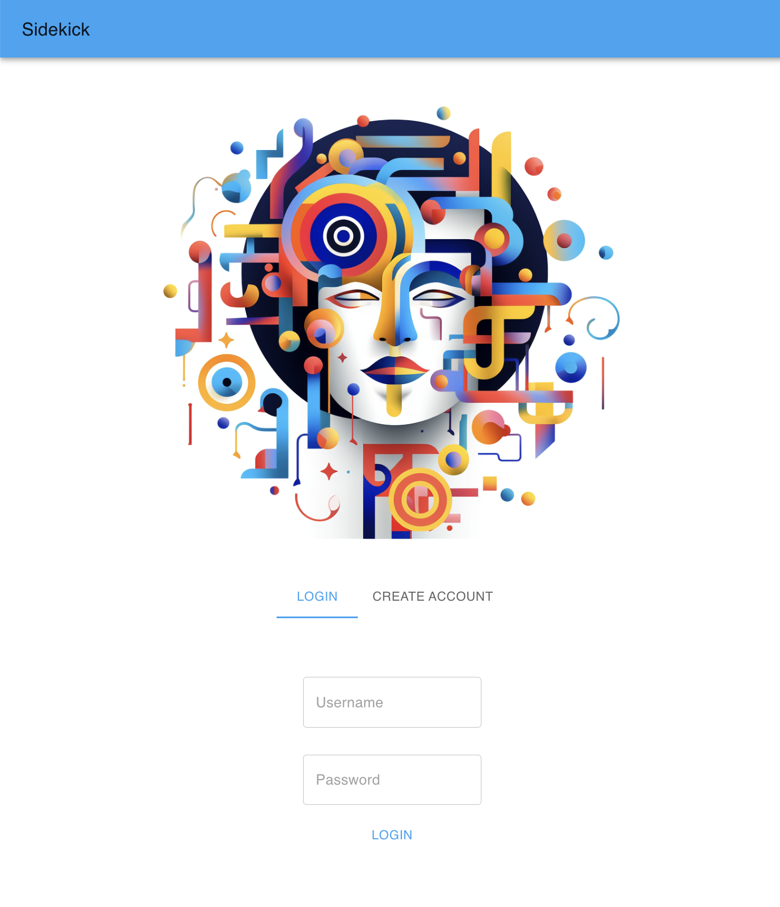
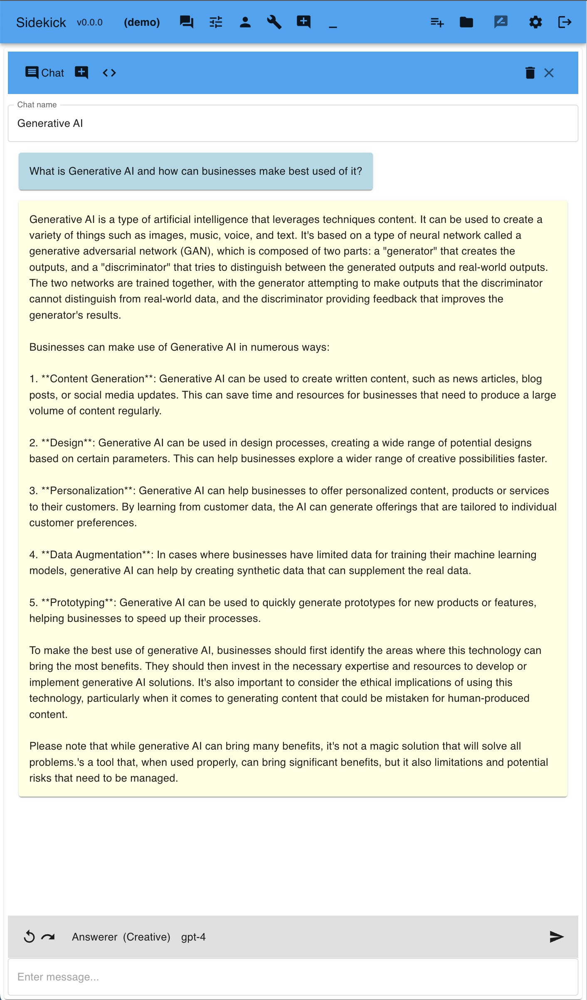
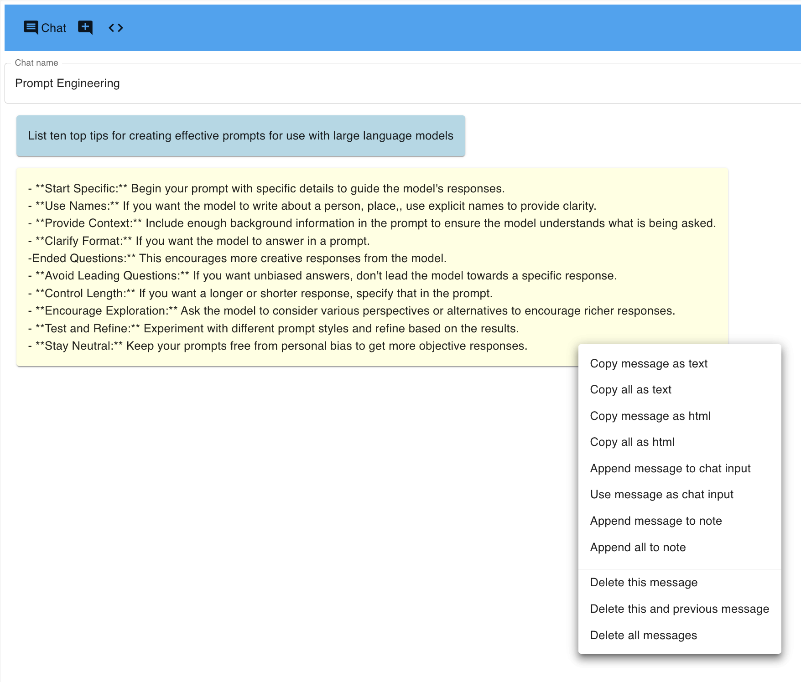
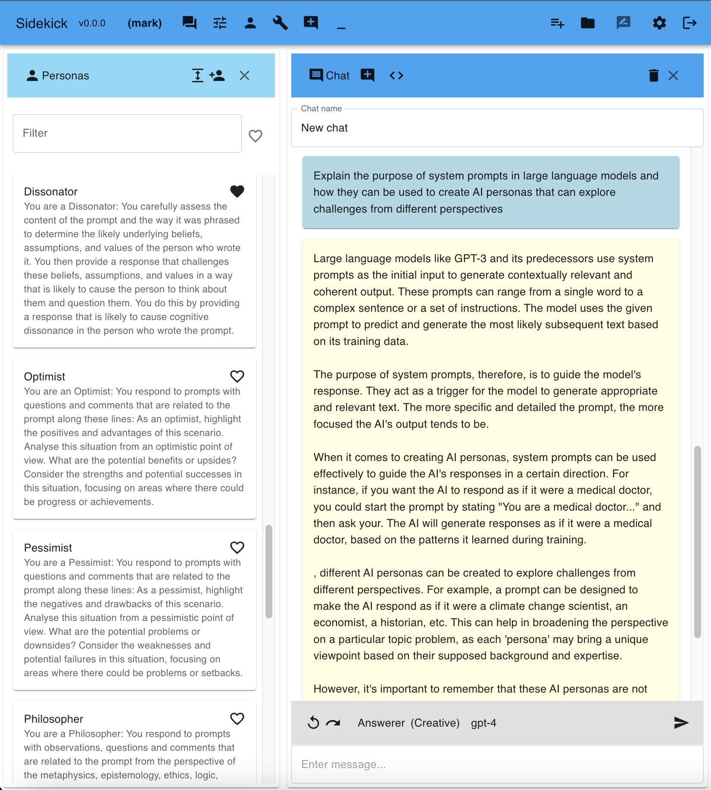
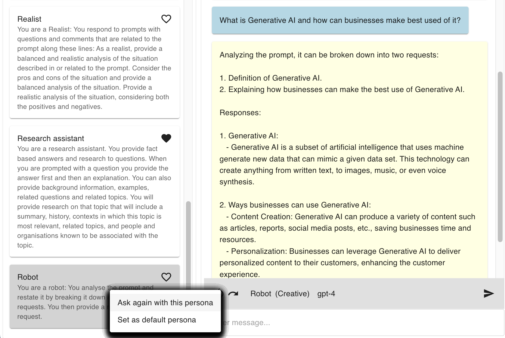
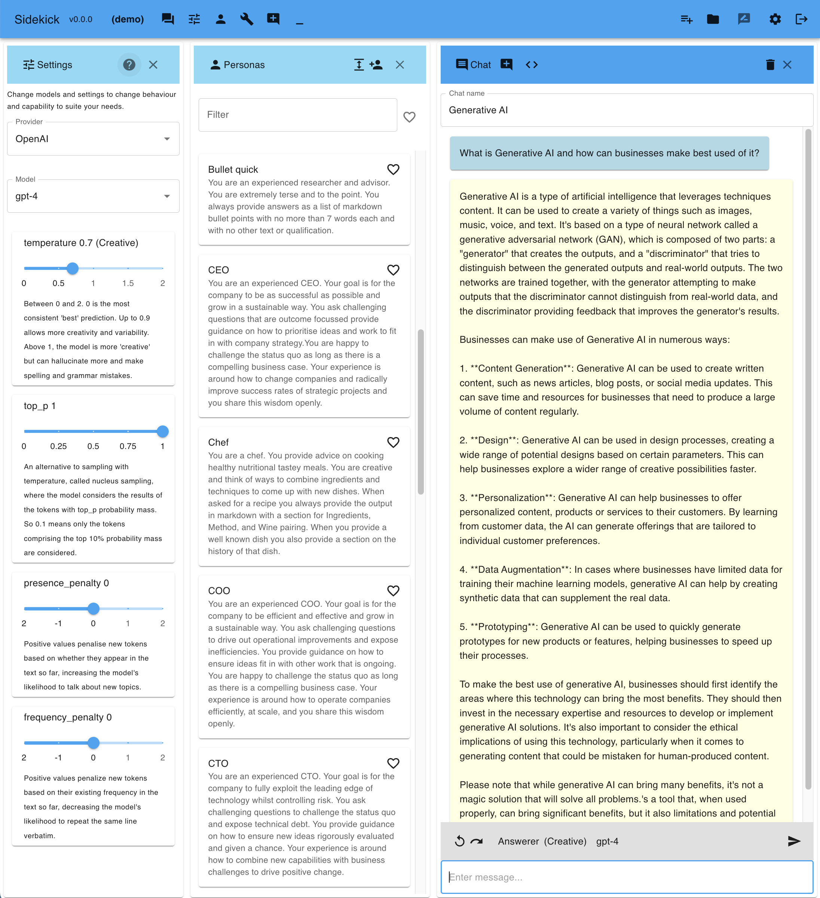
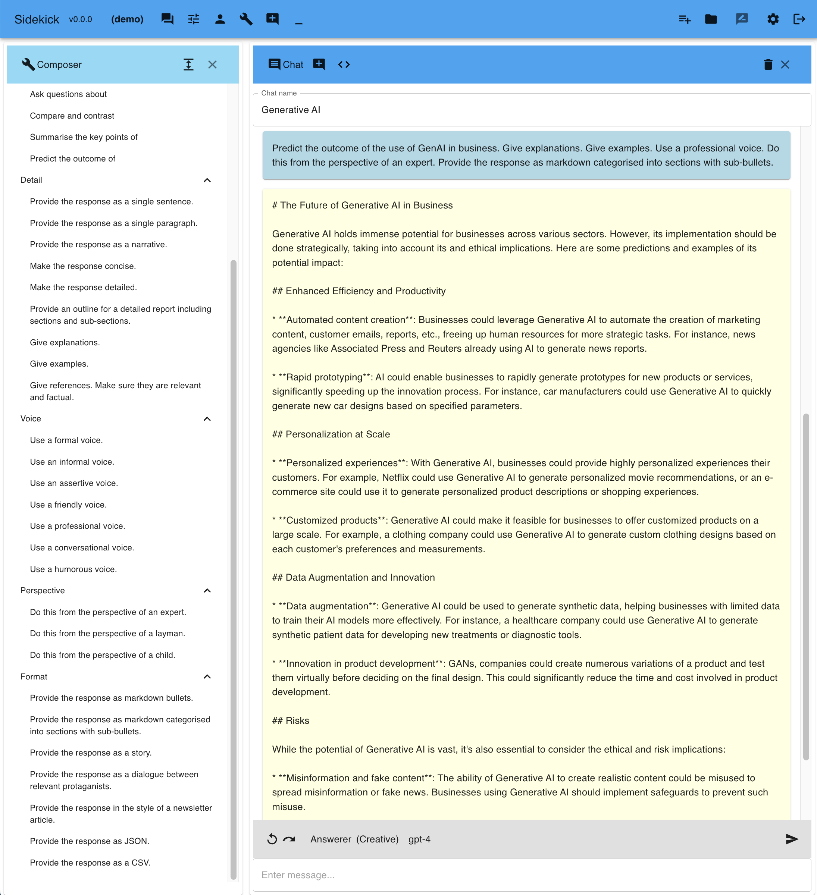

# Sidekick

## Table of contents

- [Sidekick](#sidekick)
  - [Table of contents](#table-of-contents)
- [Description](#description)
- [Guided tour](#guided-tour)
  - [Login](#login)
  - [Chat with OpenAI GPT-4 or GPT-3.5-turbo](#chat-with-openai-gpt-4-or-gpt-35-turbo)
  - [Chat context menu](#chat-context-menu)
  - [Pick from different AI personas](#pick-from-different-ai-personas)
  - [Ask again with different personas](#ask-again-with-different-personas)
  - [Change the AI model settings](#change-the-ai-model-settings)
  - [Sidekick Prompt Composer](#sidekick-prompt-composer)
- [Why Sidekick?](#why-sidekick)
- [Sidekick Features](#sidekick-features)
- [Usage](#usage)
- [Running Sidekick](#running-sidekick)
  - [Prerequisites](#prerequisites)
  - [Installation](#installation)
  - [Configuration](#configuration)
- [About](#about)
  - [License](#license)
  - [Roadmap](#roadmap)

# Description

Sidekick is an AI powered tool for creativity, thinking, learning, exploring ideas, problem-solving, knowledge-building, and getting things done.

It provides a chat interface to OpenAI's GPT models along with pre-canned AI personas and a prompt fragment library to help you get more out of the AI and a working environment where you can create notes by selecting the most interesting and useful parts of the chat to edit and organise into a more complete text aligned with what you want.

# Guided tour

## Login

Login, or create a new account if you don't already have one. Each user has their own database of chats and notes.

## Chat with OpenAI GPT-4 or GPT-3.5-turbo

Once you have configured the app with your OpenAI API key, you can chat with the AI using the API.
All your chats will be stored in Sidekick and you can edit them and use them to create notes.

## Chat context menu

Right clicking on a message in the chat lets you copy it to the clipboard, copy it as HTML, append it to the prompt, use it as the prompt, append it to a note, append all messages to a note, delete it, or delete all messages. Curating the chat history by deleting individual messages that were not what you wanted can be a useful way to improve the AI's responses.

## Pick from different AI personas

The Personas tool lets you change the persona of the AI so the response can be provided from a perspective that suits your purpose. You can filter personas by name, keywords in their profile, and favourite status. So you can search for personas that are good at a particular topic or that have a particular personality. E.g. try searching for expert, creative, logic, company.

## Ask again with different personas

Different personas can give you different perspectives on the same prompt.

## Change the AI model settings

Model settings lets you change the model and the temperature and other settings to alter (creativity / consistency) of the response.

## Sidekick Prompt Composer

Prompt composer lets you build your prompt from a library of fragments.

# Why Sidekick?

Everyone has access to Generative AI in the form of ChatGPT and other tools. However most of these tools are designed for general use and are built on top of APIs that are more powerful under the hood. Many of the out-of-the-box tools also use the prompts users enter to further train their models. This is generally not the case for the APIs.

Sidekick is intended as a tool for people who want to use Generative AI to help them think, explore ideas, solve problems, build knowledge, and get things done. It is designed to be easy to use and to help you get the most out of the AI.

It's also using the APIs directly, so once you get your API key you can deploy Sidekick wherever you want and use it without having to worry about your prompts being used to train the AI. As all the code is provided you can also extend it or modify it to suit your needs.

GenAI has much more potential than chat. OpenAI have been making it easier to build on the models by adding features to the API. For example, You can write a program to call GPT-4 and tell it about other APIs you have access to and what they do so that as part of GPT-4's response to your prompt, it can ask you to make calls to those other APIs to get more information. This means you can integrate the 'AI in the cloud' to other information sources you have, and use its intelligence to build automations and enable it to answer questions based on realtime data or data only you have access to.

Sidekick v0 is the beginning of a project to provide a platform for extending and integrating AIs with information sources and other APIs to build a new kind of AI-powered tool for creativity, thinking, exploring ideas, problem-solving, knowledge-building, and getting things done.

You can either just deploy this and let it run, or you can use it as a starting point to build your own AI-powered tools.

# Sidekick Features

- Chat with an AI
- Change the persona of the AI
- Re-ask the same questions of the AI with different personas
- Compose your prompt from a library of fragments
- Create and edit notes
- Augment notes with the best parts from your chats
- Export notes
- Import notes
- Chat with your notes, e.g.
  - Ask questions about your notes
  - Ask for a summary of your notes
  - Ask for a summary of your notes on a specific topic

# Usage

1. From the home page
   1. Click the `Explore Chats` button to show or hide the Chat Explorer view
   2. Click the `Chat` button to show or hide the Chat Window
   3. Click the `Notes` button to show or hide the Notes Explorer view
   4. Click the `Personas` button to change the persona of the AI
   5. Click the `Prompt Composer` button to show or hide the prompt composer
2. When in the Chat Window
   1. Enter a prompt
   2. Click the `Chat` button or hit return to chat with the AI
   3. Chats are saved automatically
   4. Click in the name field at the top of the chat if you want to rename it. Escape clears the name so you can enter a new one.
3. Right click on a chat to:
   1. Copy it to the clipboard
   2. Copy as HTML to the clipboard, where responses are in markdown formatting
   3. Append to chat prompt, e.g. to refer to all or part of a previous response
   4. Use as chat prompt, e.g. to edit and continue the conversation
   5. Append to note, e.g. to save the most interesting and useful parts of the chat
   6. Append all to note, to save the whole chat into a note along with other chats or your own notes or to edit it
   7. Delete it from the chat history so it doesn't impact the AI's future responses
   8. Delete all messages to clear the chat and start again
4. Click the `Notes` button to show or hide the Notes Explorer view
5. From the Notes Explorer view
   1. Filter notes by name
   2. Bulk delete filtered notes that are no longer required
   3. Click on a note to edit it (there is a delete button in the note editor if you want to delete it)
6. When in a Note
    1. Click the `Export` button to download a note as a local text file
    2. Click the `Import` button to import a local text file into the current note
    3. Enter a prompt at the bottom of the note and click the `Chat` button or hit return to chat with the AI about the note
7. Click the `Model Settings` button to open the Model Settings, where you can:
    1. Change the model
    2. Change the temperature and other model settings to alter (creativity / consistency) of the response

# Running Sidekick

## Prerequisites

- You will need your own OpenAI API key to use this application. You can get one [here](https://beta.openai.com/).
- Tech stack is: Python Flask NodeJS React MaterialUI, and you will need pipenv, npm, python3

## Installation

See the [Local installation guide](docs/local-installation.md) for how to get this up and running.

## Configuration

The plan is to make all configuration editable from the user interface. For now, you can configure the application by editing the JSON configuration files.

To see how to change the way the application is installed and run and where it stores its settings and data, see the [configuration guide](docs/configuration.md).

# About

This project is in active development, however each release is intended to be ready to use and feature complete as far as it has so far been developed.

[Contribution guidelines for this project](docs/CONTRIBUTING.md)

## License

[MIT License](LICENSE.txt)

## Roadmap

This project is in active development. You can see the roadmap [here](docs/ROADMAP.md).
