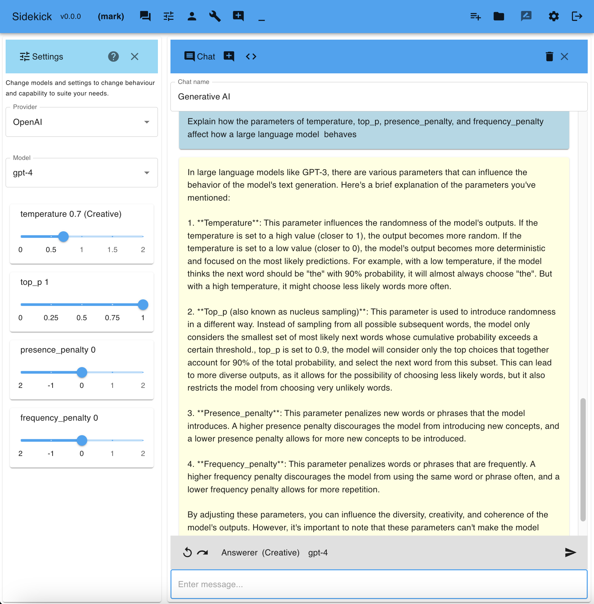

# Sidekick


## Table of contents

- [Sidekick](#sidekick)
  - [Table of contents](#table-of-contents)
- [Description](#description)
- [Guided tour](#guided-tour)
  - [Login](#login)
  - [Chat with AI models](#chat-with-ai-models)
  - [Chat Prompt Templates](#chat-prompt-templates)
  - [Chat context menu](#chat-context-menu)
  - [Chat Prompt Editor](#chat-prompt-editor)
    - [Sidekick Toolboxes](#sidekick-toolboxes)
      - [How to use Toolboxes](#how-to-use-toolboxes)
  - [Diagrams](#diagrams)
  - [Pick from different AI personas](#pick-from-different-ai-personas)
  - [Ask again with different personas](#ask-again-with-different-personas)
  - [Syntax highlighting of code](#syntax-highlighting-of-code)
  - [Change the AI model settings](#change-the-ai-model-settings)
  - [Sidekick Prompt Composer](#sidekick-prompt-composer)
  - [Sidekick Script](#sidekick-script)
  - [Sidekick Notes](#sidekick-notes)
  - [Sidekick Manual](#sidekick-manual)
  - [Sidekick AI Help](#sidekick-ai-help)
- [Why Sidekick?](#why-sidekick)
- [Sidekick Features](#sidekick-features)
- [Sidekick Release Notes](#sidekick-release-notes)
- [Usage](#usage)
- [Examples](#examples)
- [Running Sidekick](#running-sidekick)
  - [Prerequisites](#prerequisites)
  - [Installation](#installation)
  - [Configuration](#configuration)
- [About](#about)
  - [License](#license)
  - [Roadmap](#roadmap)
  - [Why did I write Sidekick?](#why-did-i-write-sidekick)
- [References](#references)
- [Appendix](#appendix)
  - [Toolboxes appendix](#toolboxes-appendix)
    - [Analysis](#analysis)
    - [Ask Others](#ask-others)
    - [Change Management](#change-management)
    - [Commands](#commands)
    - [Communication](#communication)
    - [Debate](#debate)
    - [Decision Making](#decision-making)
    - [Exploration](#exploration)
    - [Futurology](#futurology)
    - [Insights](#insights)
    - [Learning](#learning)
    - [Open Source](#open-source)
    - [Operational Excellence](#operational-excellence)
    - [Problem Solving](#problem-solving)
    - [Programming](#programming)
    - [Technology Innovation](#technology-innovation)

# Description

Sidekick is an AI powered tool for creativity, thinking, learning, exploring ideas, problem-solving, knowledge-building, and getting things done.

It provides a chat interface to OpenAI's GPT models along with pre-canned AI personas and a prompt fragment library to help you get more out of the AI and a working environment where you can create notes by selecting the most interesting and useful parts of the chat to edit and organise into a more complete text aligned with what you want.

# Guided tour

For more details, see the [Sidekick manual](web_ui/public/sidekick_manual.md)
For more insights on how to use Sidekick, ask the [Sidekick AI Help](#sidekick-ai-help)

## Login

Login, or create a new account if you don't already have one. Each user has their own database of chats and notes.


## Chat with AI models

Once you have configured the app with your OpenAI API key, you can chat with the AI using the API.
Pick which model you want to chat with in Model Settings.
All your chats will be stored in Sidekick and you can edit them and use them to create notes.


## Chat Prompt Templates

Clicking the Spanner button in the main toolbar or clicking the 'Prompt Engineer' button at the bottom of the Chat window opens the Prompt Engineer, which includes a selection of pre-canned prompt templates.

Click a template name to copy the template to the prompt window. Prompt templates have this structure:

```# Prompt Template Name
Some prompt text with optional {PARAMETERS} that you can double click on to replace with your own text.
```

To save new prompt templates of your own, just add a prompt name like this above your prompt and click the save button.


## Chat context menu

Right clicking on a message in the chat lets you copy it to the clipboard, copy it as HTML, append it to the prompt, use it as the prompt, append it to a note, append all messages to a note, delete it, or delete all messages. Curating the chat history by deleting individual messages that were not what you wanted can be a useful way to improve the AI's responses.


When text is selected, you can submit prompts provided in the **Selection Actions sub-menu** applied to that selection.


The **Chat Actions sub-menu** provides actions that can be applied to the whole chat.


## Chat Prompt Editor

The Chat Prompt Editor lets you edit the prompt before sending it to the AI. You can use the prompt composer to build your prompt from a library of fragments, or you can use the prompt templates to get you started. The Prompt Editor has various commands and prompt templates available in its menu, which can also be accessed from the keyboard by pressing "/" when the prompt is empty.

When clicking on the prompt editor menu and selecting a prompt, you can press and hold the Alt key to put the prompt into the editor without running it so you can update it. When navigating the menus from the keyboard after pressing "/" in an empty prompt to open the menu, using right arrow on a template will place it in the editor. Clicking or pressing enter will run the template immediately, hence applying it to the content of the chat.

### Sidekick Toolboxes


Sidekick includes a range of prompt collections presented as a Toolbox that sits alongside the Chat. These prompts are designed to get the AI to apply deeper and more structured, or more creative, techniques. The toolbox has multiple 'trays' of prompt collections around specific themes.

Many of the innovation, creativity, thinking, and structured analysis techniques that have been developed over the years are documented in detail in books and on the Internet and have been incorporated into the training data of Large Language Models. The AI knows these methods. You just need to know how to get it to apply them. That's where the prompt collections come in.

**Accessing Prompt Collections**

Prompt collections are available from a number of places:
- Click the Prompt Editor hamburger menu and click 'Prompt Collections'
- Press the slash ('/') key when in the prompt editor.
- Click the Toolbox icon in the Chat main toolbar. This will open the toolbox, which presents each prompt collection as a palate of buttons for related prompts to the left of the chat.

#### How to use Toolboxes

Each prompt collection or toolbox is designed to cater to specific use cases, offering a range of tools that can be utilised together to enhance creativity, learning, decision-making, problem-solving, communication, etc.

Select a Toolbox from the selector at the top. Hover over a tool button to see a tooltip describing what it does. Click the button to run the prompt immediately. ALT+Click to add the prompt to the Prompt Editor so you can update it before hitting send.

You can use Toolboxes on an ad-hoc basis to get the AI to apply a specific technique or method to the current conversation. You can also use them to structure a conversation around a specific theme or to explore a particular topic in more depth. If you combine setting a Chat Context and Goal with using a Toolbox then you can develop a chat by simply clicking around the different toolbox items to direct the AI in the direction you want.

**Index Toolboxes (links to Appendix)**
- [Analysis](#analysis)
- [Ask Others](#ask-others)
- [Change Management](#change-management)
- [Commands](#commands)
- [Communication](#communication)
- [Debate](#debate)
- [Decision Making](#decision-making)
- [Exploration](#exploration)
- [Futurology](#futurology)
- [Insights](#insights)
- [Learning](#learning)
- [Open Source](#open-source)
- [Operational Excellence](#operational-excellence)
- [Problem Solving](#problem-solving)
- [Programming](#programming)
- [Technology Innovation](#technology-innovation)

## Diagrams

The diagram prompts instruct the AI to create mermaid markdown diagrams that Sidekick then renders. You can develop these diagrams further conversationally by saying how you want them modified.

Diagrams include:

- Flowchart
- Mind Map
- Use Case Diagram
- Functional Decomposition Diagram
- Sequence Diagram
- Class Diagram
- Perimeter Diagram
- Entity Relationship Diagram
- State Diagram
- Timeline
- Gantt Chart

You can also use these as a basis for describing your own dirgam types within the limitations of what mermaid supports.
You can access diagram prompts from the prompt editor menu or by pressing "/" in an empty prompt.


## Pick from different AI personas

The Personas tool lets you change the persona of the AI so the response can be provided from a perspective that suits your purpose. You can filter personas by name, keywords in their profile, and favourite status. So you can search for personas that are good at a particular topic or that have a particular personality. E.g. try searching for expert, creative, logic, company.


## Ask again with different personas

Different personas can give you different perspectives on the same prompt.


## Syntax highlighting of code

Code blocks are syntax highlighted.


## Change the AI model settings

Model settings lets you change the model and the temperature and other settings to alter (creativity / consistency) of the response.



## Sidekick Prompt Composer

Prompt composer lets you build your prompt from a library of fragments.


## Sidekick Script

Sidekick Script can be created in a jupyter notebook style tool that lets you create cells of different types including text, lists, and templates to parameterise prompts for querying the AI.

Here is an example script to generate a quiz where the number of questions, topic areas, themes, methods for creating questions, and difficulty levels are parameterised. The script uses the AI to generate the questions and answers:


## Sidekick Notes

Sidekick Notes lets you create and edit notes. You can also import and export notes as text files, copy selected AI responses over from the chat window, and use the NoteWriter AI to write your note for you by telling it what you want.


Notes let you edit the content in plain text markdown and then render a view with the formatting applied.


## Sidekick Manual

The Sidekick Manual explains the features of the tool, the ideas behind them, how to use Sidekick and different scenarios you can use it for.


## Sidekick AI Help

Sidekick AI Help lets you ask questions of the manual rather than reading it!

It also draws on the knowledge of GPT to expand on the principles outlined in the manual, which includes innovation techniques as well as descriptions of how the tool can be used, and provides examples of how to apply the tool to what you are working on.


# Why Sidekick?

Everyone has access to Generative AI in the form of ChatGPT and other tools. However most of these tools are designed for general use and are built on top of APIs that are more powerful under the hood. Many of the out-of-the-box tools also use the prompts users enter to further train their models. This is generally not the case for the APIs.

Sidekick is intended as a tool for people who want to use Generative AI to help them think, explore ideas, solve problems, build knowledge, and get things done. It is designed to be easy to use and to help you get the most out of the AI.

It's also using the APIs directly, so once you get your API key you can deploy Sidekick wherever you want and use it without having to worry about your prompts being used to train the AI. As all the code is provided you can also extend it or modify it to suit your needs.

GenAI has much more potential than chat. OpenAI have been making it easier to build on the models by adding features to the API. For example, You can write a program to call GPT-4 and tell it about other APIs you have access to and what they do so that as part of GPT-4's response to your prompt, it can ask you to make calls to those other APIs to get more information. This means you can integrate the 'AI in the cloud' to other information sources you have, and use its intelligence to build automations and enable it to answer questions based on realtime data or data only you have access to.

Sidekick v0 is the beginning of a project to provide a platform for extending and integrating AIs with information sources and other APIs to build a new kind of AI-powered tool for creativity, thinking, exploring ideas, problem-solving, knowledge-building, and getting things done.

You can either just deploy this and let it run, or you can use it as a starting point to build your own AI-powered tools.

# Sidekick Features

- Chat with an AI
- Change the persona of the AI
- Re-ask the same questions of the AI with different personas
- Compose your prompt from a library of fragments
- Create and edit notes
- Augment notes with the best parts from your chats
- Export notes
- Import notes
- Use the Note Writer to write your note for you
- Add notes to the AI knowledge library so they can be used as knowledge in Chat
- Use the AI knowledge library to augment the AI's knowledge
  - Create notes defining concepts of information that you want the AI to know about
  - Click the book icon at the bottom of the Chat window to load notes as knowledge for use in that chat
  - Your notes will be added into the user prompt automatically to provide context for the AI to respond to your prompt
  - Add knowledge notes about you and how you want the AI to behave, what you are interested in, or specific knowledge relevant to you the AI doesn't know about

# Sidekick Release Notes

Go here: [Release notes](docs/release_notes.md)

# Usage

1. From the home page
   1. Click the `Explore Chats` button to show or hide the Chat Explorer view
   2. Click the `Chat` button to show or hide the Chat Window
   3. Click the `Notes` button to show or hide the Notes Explorer view
   4. Click the `Personas` button to change the persona of the AI
   5. Click the `Prompt Composer` button to show or hide the prompt composer
2. When in the Chat Window
   1. Enter a prompt
   2. Click the `Chat` button or hit return to chat with the AI
   3. Chats are saved automatically
   4. Click in the name field at the top of the chat if you want to rename it. Escape clears the name so you can enter a new one.
3. Right click on a chat to:
   1. Copy it to the clipboard
   2. Copy as HTML to the clipboard, where responses are in markdown formatting
   3. Append to chat prompt, e.g. to refer to all or part of a previous response
   4. Use as chat prompt, e.g. to edit and continue the conversation
   5. Append to note, e.g. to save the most interesting and useful parts of the chat
   6. Append all to note, to save the whole chat into a note along with other chats or your own notes or to edit it
   7. Delete it from the chat history so it doesn't impact the AI's future responses
   8. Delete all messages to clear the chat and start again
4. Click the `Notes` button to show or hide the Notes Explorer view
5. From the Notes Explorer view
   1. Filter notes by name
   2. Bulk delete filtered notes that are no longer required
   3. Click on a note to edit it (there is a delete button in the note editor if you want to delete it)
6. When in a Note
    1. Click the `Export` button to download a note as a local text file
    2. Click the `Import` button to import a local text file into the current note
    3. Enter a prompt at the bottom of the note and click the `Chat` button or hit return to chat with the AI about the note
7. Click the `Model Settings` button to open the Model Settings, where you can:
    1. Change the model
    2. Change the temperature and other model settings to alter (creativity / consistency) of the response

# Examples

- [How can I use Sidekick to help me develop an IT Transformation Strategy?](docs/examples/IT_Transformation_Strategy.md)

# Running Sidekick

## Prerequisites

- You will need your own OpenAI API key to use this application. You can get one [here](https://beta.openai.com/).
- Tech stack is: Python Flask NodeJS React MaterialUI, and you will need pipenv, npm, python3

## Installation

See the [Local installation guide](docs/local-installation.md) for how to get this up and running.

## Configuration

The plan is to make all configuration editable from the user interface. For now, you can configure the application by editing the JSON configuration files.

To see how to change the way the application is installed and run and where it stores its settings and data, see the [configuration guide](docs/configuration.md).

# About

This project is in active development, however each release is intended to be ready to use and feature complete as far as it has so far been developed.

[Contribution guidelines for this project](docs/CONTRIBUTING.md)

## License

[MIT License](LICENSE.txt)

## Roadmap

This project is in active development. You can see the roadmap [here](docs/roadmap.md).

## Why did I write Sidekick?

I’ve worked with technology all my life and was in consulting for over 15 years. In that time I've built many many tools and learnt many methods and techniques for solving problems and innovating and thinking through how to create positive change to effect outcomes that create impact. Since GenAI took off it became clear that a lot of this knowledge is encapsulated in these large language models. I saw an opportunity to leverage this to create a tool that would bring together ways of thinking, methods, and techniques and harness some of that knowledge within those models and make it easier to access and combine and deploy as part of a way of planning and forging a way forward for anyone trying to create positive change. The tools I've created in the past have sometimes been general purpose innovation, creativity, or problem solving tools, and other times they have been very specific tools designed for one thing. With GenAI under the hood, and a UI and framework for creating resource packs that define how that GenAI can be applied in different ways, its possible to have a tool that is both general purpose and can be quickly and easily tailored to help with specific kinds of situation through prompt engineering, embeddings, RAG, and all the other techniques that are emerging in the GenAI space. To that end, in this project, I’m working on features and a UI in the base sidekick platform to create an adaptable AI Workbench. The idea is to create a way for people to contribute their own prompt templates, scripts, personas, and resource packs that collect groups of these together that make sense for specific situations. In this way it should be possible for anyone to adapt the tool to by selecting resource packs of interest to them, or creating their own, so they have sets of methods and techniques powered by a large language model under the hood, that best suits what they’re trying to do and their personal way of working. A Sidekick deployment is multi-user, so you can have a team of people working together on a project, each with their own database of chats and notes, and each able to contribute to the resource packs that are available to everyone. The idea is to create a community of people who are interested in using AI to help them think, explore ideas, solve problems, build knowledge, and get things done, and to create a platform that makes it easy for them to do that.

# References

Go here: [References](docs/references.md)

# Appendix

## Toolboxes appendix

### Analysis

**Description:** Apply well-known analytical and strategic tools and methodologies designed to inform decision-making, improve the rigour and completeness of problem-solving, and navigate complex challenges effectively.

**Applications:** Decision-making, strategic planning, business analysis.

**Keywords:** Analysis, strategy, decision-making.

**Related Topics:** Business Strategy, Decision Science, Market Analysis.

**Tools:**

- **Balanced Scorecard:** Perform a Balanced Scorecard analysis on the chat content.
- **Benefits Analysis:** Conduct a Benefits Analysis on the topics discussed.
- **Business Model Canvas:** Create a Business Model Canvas based on the chat content.
- **Competitive Analysis:** Conduct a Competitive Analysis on the chat content.
- **Design Thinking:** Apply Design Thinking principles to the conversation.
- **Failure Modes Effects Analysis (FMEA):** Carry out a Failure Modes Effects Analysis (FMEA) on the issues discussed.
- **Gap Analysis:** Conduct a Gap Analysis on the current discussion.
- **Kano Model Analysis:** Perform a Kano Model Analysis on the needs or features discussed.
- **Market Entry Strategy:** Develop a Market Entry Strategy based on the conversation.
- **MoSCoW Prioritisation:** Apply MoSCoW Prioritisation to the topics discussed.
- **PEST Analysis:** Conduct a PEST Analysis on the dialogue.
- **Porters Five Forces:** Analyse the chat content using Porter’s Five Forces framework.
- **Root Cause Analysis:** Perform a Root Cause Analysis on the issues raised in the chat.
- **SMART Goals:** Formulate SMART Goals based on the objectives discussed in the chat.
- **Six Thinking Hats:** Apply the Six Thinking Hats method to the conversation.
- **Stakeholder Analysis:** Conduct a Stakeholder Analysis on the chat content.
- **SWOT Analysis:** Carry out a SWOT Analysis on the chat so far.
- **Value Chain Analysis:** Perform a Value Chain Analysis on the discussion.
- **VPEC-T Analysis:** Apply VPEC-T Analysis to the chat content.
- **Wardley Mapping:** Create a Wardley Map based on the chat content.
- **What If Analysis:** Conduct a What If Analysis on the chat.
- **Why-Why Analysis:** Perform a Why-Why Analysis on the chat content.

[Return to Sidekick Toolboxes index](#sidekick-toolboxes)

### Ask Others

**Description:** Get more rounded perspectives by simulating consulting others.

**Applications:** Brainstorming, idea generation, perspective gathering.

**Keywords:** Consultation, perspectives, brainstorming.

**Related Topics:** Collaboration, Mentorship, Peer Review.

**Tools:**

- **Be Me:** Predict my next observations and question based on the chat.
- **Consult a Friend:** Imagine my smartest friends are helping.
- **Ask a Mentor:** Imagine an expert mentor is advising.
- **Ask a Novice:** Imagine a curious novice is asking about this.
- **Ask a Skeptic:** Imagine a critical skeptic is wading in.
- **Ask a Supporter:** Imagine an enthusiastic supporter is helping.
- **Ask a Critic:** Imagine a harsh critic is raising challenges.
- **Ask a Visionary:** Imagine a creative visionary is helping.
- **Ask a Realist:** Imagine a practical realist is helping.
- **Ask a Dreamer:** Imagine an imaginative dreamer is helping.
- **Ask a Pragmatist:** Imagine a sensible pragmatist is helping.
- **Ask a Pessimist:** Imagine a skeptical pessimist is helping.
- **Ask an Optimist:** Imagine a hopeful optimist is helping.

[Return to Sidekick Toolboxes index](#sidekick-toolboxes)

### Change Management

**Description:** Prompts for managing change and transformation.

**Applications:** Organisational change, transformation projects, change strategy.

**Keywords:** Change management, transformation, organisational change.

**Related Topics:** Organisational Behaviour, Project Management, Leadership.

**Tools:**

- **Change Drivers:** Identify the drivers for change.
- **Change Impacts:** Discuss the impacts of change.
- **Change Resistance:** Identify potential resistance to change.
- **Change Strategies:** Discuss strategies for managing change.
- **Stakeholder Impact:** Identify affected stakeholders and their impact.
- **Communication Plan:** Develop a communication plan for change.
- **Training Needs:** Identify training needs for change.
- **Resource Allocation:** Discuss resource allocation for change.
- **Change Readiness:** Assess the readiness for change.
- **Mitigating Negative Outcomes:** Identify mitigation strategies for negative outcomes.
- **Coping Strategies:** Identify coping strategies for unavoidable negative outcomes.
- **Process Improvements:** Identify ways processes could be adapted to improve this situation.
- **Org Improvements:** Identify ways organisational change could improve this situation.
- **Tech Improvements:** Identify ways technology could be leveraged to improve this situation.
- **Measuring Success:** Discuss how success will be measured and assured.
- **Feedback Mechanisms:** Identify feedback mechanisms for continuous improvement.

[Return to Sidekick Toolboxes index](#sidekick-toolboxes)

### Commands

**Description:** Quickly send one of a number of simple common commands to the AI.

**Applications:** General conversation, summarisation, elaboration.

**Keywords:** Commands, conversation, summarisation.

**Related Topics:** Communication, Interaction, Dialogue.

**Tools:**

- **Continue:** Continue the conversation.
- **Summarise:** Summarise the current discussion.
- **Summarise as Bullets:** Summarise key points as a bullet list.
- **Elaborate:** Elaborate on that.
- **Give Examples:** Provide some examples.
- **Provide More Detail:** Provide more detail.
- **Explain in Simple Terms:** Explain in simple terms.
- **Explain in Detail:** Explain in detail.
- **Background and History:** Provide the background and history.
- **Pros and Cons:** What are the pros and cons?
- **Simplify:** How can we simplify this?
- **Pivot Topic:** Pivot the conversation to a different but related topic.
- **Alternative Perspective:** Provide an alternative perspective.
- **Contrary View:** Propose a contrary view.

[Return to Sidekick Toolboxes index](#sidekick-toolboxes)

### Communication

**Description:** Prompts to help refine and create effective communication.

**Applications:** Drafting emails, creating presentations, writing reports.

**Keywords:** Communication, writing, presentation.

**Related Topics:** Business Communication, Technical Writing, Public Speaking.

**Tools:**

- **Draft an Email:** Draft a professional email based on the discussion.
- **Create a Presentation Outline:** Create an outline for a presentation.
- **Summarise Key Points:** Summarise the key points from the discussion.
- **Generate a Report:** Generate a report based on the discussion.
- **Write a Social Media Post:** Draft a social media post based on the discussion.
- **Create Talking Points:** Create talking points for a meeting or presentation.
- **Write an Article:** Draft an article based on the discussion.
- **Formulate a Response:** Formulate a response to a query or statement.
- **Prepare a Speech:** Prepare a speech based on the discussion.
- **Create a Proposal:** Draft a proposal based on the discussion.
- **Draft a Press Release:** Draft a press release based on the discussion.
- **Create a FAQ:** Create a list of frequently asked questions and answers.
- **Write a Blog Post:** Draft a blog post based on the discussion.
- **Create a Tweet:** Create a tweet based on the discussion.
- **Prepare an Elevator Pitch:** Prepare an elevator pitch based on the discussion.

[Return to Sidekick Toolboxes index](#sidekick-toolboxes)

### Debate

**Description:** Prompts for engaging in a debate or argument.

**Applications:** Argumentation, critical thinking, persuasive speaking.

**Keywords:** Debate, argument, persuasion.

**Related Topics:** Rhetoric, Logic, Public Speaking.

**Tools:**

- **Refute:** Provide a refutation.
- **Cross-Examination:** Conduct a cross-examination.
- **Signposting:** Use signposting to structure your argument.
- **Evidence and Examples:** Provide evidence and examples.
- **Analogies and Comparisons:** Use analogies and comparisons.
- **Anticipate Counterarguments:** Anticipate counterarguments and construct responses.
- **Rhetorical Questions:** Use rhetorical questions to engage the audience.
- **Summarisation:** Summarise the arguments.
- **Challenge Assumptions:** Challenge the assumptions made.
- **Propose a Different Approach:** Propose a different approach.
- **Predict Consequences:** Predict the consequences, issues, and questions raised.
- **Pivot Argument:** Pivot the debate to come at it from a different angle.

[Return to Sidekick Toolboxes index](#sidekick-toolboxes)

### Decision Making

**Description:** Tools and prompts for making decisions.

**Applications:** Decision-making, strategic planning, risk analysis.

**Keywords:** Decision-making, strategy, evaluation.

**Related Topics:** Decision Science, Risk Management, Strategic Planning.

**Tools:**

- **Identify the Decision:** Clearly define the decision to be made.
- **Set Objectives:** Set clear objectives for the decision.
- **Generate Options:** Generate a range of options.
- **Evaluate Options:** Evaluate the options against the objectives.
- **Pros and Cons:** List the advantages and disadvantages of each option.
- **Decision Matrix:** Create a decision matrix to compare options.
- **Weighted Decision Matrix:** Develop a weighted decision matrix to evaluate options.
- **Risk Analysis:** Perform a risk analysis for each option.
- **Make a Decision:** Make a decision based on the evaluation.

[Return to Sidekick Toolboxes index](#sidekick-toolboxes)

### Exploration

**Description:** Explore the situation or topic further.

**Applications:** Research, learning, brainstorming.

**Keywords:** Exploration, research, learning.

**Related Topics:** Knowledge Management, Research Methodology, Learning Techniques.

**Tools:**

- **Questions Raised:** Explore what questions this raises.
- **Implications:** Explore the implications of this.
- **Related Topics:** Identify related topics.
- **Related Trends:** Identify related trends.
- **Underlying Principles:** Explain the fundamental principles underlying this.
- **Historical Precedents:** Compare this situation with historical precedents or trends.
- **Common Misconceptions:** Identify common misconceptions or misunderstandings.
- **Learning Resources:** Find more information or resources.
- **Alternative Perspectives:** Explore alternative perspectives or viewpoints.
- **Learning Opportunities:** Identify learning opportunities from this situation.
- **Tech Enablers:** Identify ways technology could improve this situation.
- **Business Model Ideas:** Explore potential business model ideas and opportunities related to this.
- **Go Up a Level:** Explore the super-system, ecosystem, and related systems.
- **Go Down a Level:** Explore the sub-systems and dependencies.

[Return to Sidekick Toolboxes index](#sidekick-toolboxes)

### Futurology

**Description:** Prompts for exploring and envisioning potential future scenarios.

**Applications:** Future planning, trend analysis, scenario planning.

**Keywords:** Futurology, trends, future scenarios.

**Related Topics:** Strategic Foresight, Scenario Planning, Trend Analysis.

**Tools:**

- **Predict Trends:** Predict future trends.
- **Technological Advancements:** Discuss future technological advancements.
- **Future Challenges:** Identify future challenges.
- **Future Opportunities:** Explore future opportunities.
- **Scenario Planning:** Create future scenarios.
- **Impact on Society:** Discuss the potential societal impact.
- **Ethical Considerations:** Examine ethical considerations.
- **Future Innovations:** Speculate on future innovations.
- **Long-term Vision:** Articulate a long-term vision of the future.
- **Global Impact:** Discuss the global impact.
- **Environmental Impact:** Analyse the environmental impact.
- **Economic Impact:** Evaluate the economic impact.
- **Cultural Shifts:** Explore potential cultural shifts.
- **Policy Implications:** Discuss policy implications.
- **Evolve with Worsening Action:** What might this situation evolve into if the tensions are not resolved and the actions that are taken progressively make things worse?
- **Evolve with Improving Action:** What might this situation evolve into if the tensions are resolved and actions are taken to progressively improve the situation?
- **Evolve with Worst Action:** What might this situation evolve into if the tensions are not resolved and the worst possible actions are taken to make things worse?
- **Evolve with Best Action:** What might this situation evolve into if the tensions are resolved and the best possible actions are taken to improve the situation?

[Return to Sidekick Toolboxes index](#sidekick-toolboxes)

### Insights

**Description:** Gain insights to help with understanding and learning more about the situation.

**Applications:** Analysis, strategic planning, decision-making.

**Keywords:** Insights, analysis, understanding.

**Related Topics:** Business Intelligence, Data Analysis, Knowledge Management.

**Tools:**

- **Identify Key Insights:** Identify key insights from the discussion.
- **Highlight Important Patterns:** Highlight important patterns and trends.
- **Summarise Main Points:** Summarise the main points of the discussion.
- **Provide Context:** Provide context for the current situation.
- **Draw Conclusions:** Draw conclusions based on the information discussed.
- **Predict Outcomes:** Predict potential outcomes based on the current discussion.
- **Identify Gaps in Knowledge:** Identify gaps in knowledge or information.
- **Suggest Further Reading:** Suggest further reading or resources.
- **Provide Expert Opinion:** Provide expert opinion on the topic.
- **Identify Potential Biases:** Identify potential biases in the discussion.
- **Compare with Industry Standards:** Compare the situation with industry standards or benchmarks.
- **Highlight Best Practices:** Highlight best practices related to the topic.
- **Identify Key Stakeholders:** Identify key stakeholders and their interests.
- **Analyse Risks and Opportunities:** Analyse risks and opportunities in the current situation.
- **Provide Historical Context:** Provide historical context for the current situation.
- **Suggest Improvements:** Suggest improvements or next steps.
- **Evaluate Impact:** Evaluate the impact of different factors on the situation.
- **Identify Trends:** Identify trends that could affect the situation.
- **Provide a SWOT Analysis:** Provide a SWOT analysis for the current situation.

[Return to Sidekick Toolboxes index](#sidekick-toolboxes)

### Learning

**Description:** Useful prompts for learning about a topic.

**Applications:** Education, research, self-improvement.

**Keywords:** Learning, education, knowledge.

**Related Topics:** Pedagogy, Lifelong Learning, Educational Technology.

**Tools:**

- **Elaborate:** Elaborate on this further.- **Provide Examples:** Give examples with explanations to bring the topic to life.
- **Explain:** Explain how something works or is the way it is.
- **Real World Applications:** Describe real-world applications of this.
- **History:** Provide the history for this.
- **Future:** Hypothesise about the future of this.
- **Zoom In:** Pick an area to do a deep dive into.
- **Zoom Out:** Find out about the bigger picture.
- **Related Topics:** Find out about related topics.
- **Compare and Contrast:** Compare and contrast with other similar topics.
- **Common Misconceptions:** Identify and clarify common misconceptions.
- **Step-by-Step Guide:** Provide a step-by-step guide.
- **Pros and Cons:** List the advantages and disadvantages.
- **Key Terminology:** Define key terms related to this topic.
- **Visualisation:** Create a visual representation.

[Return to Sidekick Toolboxes index](#sidekick-toolboxes)

### Open Source

**Description:** Useful prompts for open source projects.

**Applications:** Open source development, community engagement, software projects.

**Keywords:** Open source, software, community.

**Related Topics:** Software Development, Community Management, Licensing.

**Tools:**

- **Open Source Libraries for This:** What open source libraries can do this?
- **Further Research:** Where to do more research.
- **Project Health:** Ask for project details if not provided.
- **Community Metrics:** Provide or get community metrics.
- **Open Source Action:** Talk to your company's open source office.
- **Code Quality:** Ensure code quality.
- **Documentation Best Practices:** Documenting best practices.
- **Attract Contributors:** Manage contributors.
- **Automate Testing:** Tools to automate testing and deployment.
- **Licensing Issues:** Handle licensing issues.
- **Project Promotion:** Promote within the community.
- **CI/CD Integration:** Ask for tech stack if not described.
- **Security Best Practices:** Security best practices.
- **Effective Communication:** Communicate with the community.
- **Common Pitfalls:** Common pitfalls to avoid.
- **Product Management:** Product management concerns.
- **User Questions:** Questions for end users.
- **Cost Savings:** Determine cost savings.
- **Leading Projects:** Leading projects in the space.

[Return to Sidekick Toolboxes index](#sidekick-toolboxes)

### Operational Excellence

**Description:** Prompts for achieving operational excellence.

**Applications:** Process improvement, efficiency, quality management.

**Keywords:** Operations, efficiency, improvement.

**Related Topics:** Lean Management, Six Sigma, Total Quality Management.

**Tools:**

- **Process Optimisation:** How can we optimise this process?
- **Waste Reduction:** Identify areas where we can reduce waste in our operations.
- **Quality Improvement:** How can we improve the quality of our products or services?
- **Cost Reduction:** Identify opportunities for cost reduction in our operations.
- **Customer Satisfaction:** How can we improve customer satisfaction?
- **Employee Engagement:** How can we improve employee engagement and motivation?
- **Performance Measurement:** What are the key metrics we should track to measure our performance?
- **Continuous Improvement:** How can we establish a culture of continuous improvement?
- **Risk Management:** Identify potential risks in our operations and suggest mitigation strategies.
- **Benchmarking:** How do we compare to industry benchmarks in terms of operational efficiency?

[Return to Sidekick Toolboxes index](#sidekick-toolboxes)

### Problem Solving

**Description:** Help with problem-solving.

**Applications:** Troubleshooting, root cause analysis, solution generation.

**Keywords:** Problem-solving, troubleshooting, analysis.

**Related Topics:** Critical Thinking, Decision Science, Root Cause Analysis.

**Tools:**

- **Causes:** Explore the factors leading to this situation and what caused it.
- **Contributing Factors:** Explain the key factors contributing to this situation.
- **Impact:** Discuss potential short-term and long-term impacts.
- **Prevention:** Discuss prevention strategies.
- **Overcoming Barriers:** Identify barriers and solutions.
- **Risks and Uncertainties:** Identify potential risks and uncertainties.
- **Compare and Contrast:** Compare and contrast a variety of options.
- **Predict Outcomes:** Predict outcomes and questions they raise.
- **Evaluate Options:** Evaluate the options.
- **Ethical Considerations:** Discuss ethical considerations.
- **Legal Implications:** Discuss legal implications.
- **Problems & Conflicts:** Identify key problems and conflicts and potential solutions.
- **Skills & Experience:** Identify skills and experience that could help.
- **Lessons from History:** Discuss historical precedents and lessons.

[Return to Sidekick Toolboxes index](#sidekick-toolboxes)

### Programming

**Description:** Prompts and tools for code development.

**Applications:** Software development, code optimisation, debugging.

**Keywords:** Coding, programming, software.

**Related Topics:** Software Engineering, Computer Science, DevOps.

**Tools:**

- **Provide Code:** Provide code.
- **Explain Code:** Explain this code in more detail.
- **Identify Errors:** Identify and explain any errors in this code.
- **Suggest Improvements:** How could this code be improved or optimised?
- **Refactor Code:** Refactor this code for better readability and maintainability.
- **Write Test Cases:** Write unit tests to verify the correctness of this code.
- **Generate Documentation:** Generate documentation for this code.
- **Explain Design Patterns:** Identify any design patterns used in this code and explain their purpose.
- **Suggest Libraries:** Suggest relevant libraries or frameworks that could be used with this code.
- **Performance Optimisation:** How can the performance of this code be optimised?
- **Security Best Practices:** Identify potential security vulnerabilities and suggest best practices for this code.

[Return to Sidekick Toolboxes index](#sidekick-toolboxes)

### Technology Innovation

**Description:** Prompts to explore emerging technologies and trends.

**Applications:** Tech innovation, trend analysis, future planning.

**Keywords:** Tech, innovation, future.

**Related Topics:** Emerging Technologies, Innovation Management, Trend Analysis.

**Tools:**

- **Emerging Trends:** What are the most promising emerging technologies?
- **Industry Disruption:** How are new technologies disrupting traditional industries?
- **Future Predictions:** What are some predictions for the future of technology?
- **Ethical Considerations:** What are the ethical implications of emerging technologies?
- **Tech Investment:** What are some promising areas for technology investment?
- **Impact on Society:** How are new technologies impacting society?
- **Tech Adoption Challenges:** What are the challenges of adopting new technologies?
- **Tech Career Paths:** What are some promising career paths in the technology field?
- **Innovation Strategies:** What strategies can companies use to foster innovation?
- **Tech Regulation:** What are the current debates around technology regulation?

[Return to Sidekick Toolboxes index](#sidekick-toolboxes)
