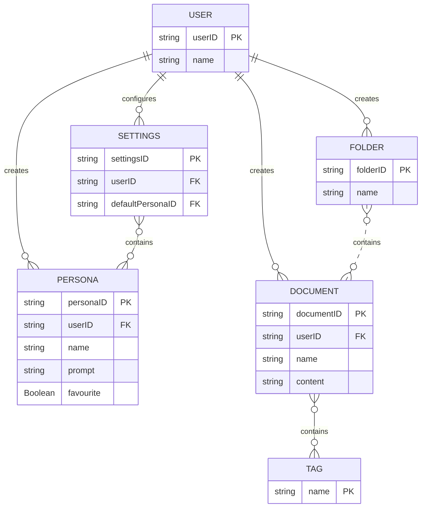

# Entity Relationship Diagram   

```mermaid
erDiagram
    USER ||--o{ SETTINGS: configures
    USER ||--o{ PERSONA: creates
    USER ||--o{ FOLDER: creates
    USER ||--o{ DOCUMENT: creates
    USER {
        string userID PK
        string name
    }
    SETTINGS }o--o{ PERSONA: contains
    SETTINGS {
        string settingsID PK
        string userID FK
        string defaultPersonaID FK
    }
    PERSONA {
        string personaID PK
        string userID FK
        string name
        string prompt
        Boolean favourite
    }
    FOLDER }o..o{ DOCUMENT: contains
    FOLDER {
        string folderID PK
        string name
    }
    DOCUMENT }o--o{ TAG: contains
    DOCUMENT {
        string documentID PK
        string userID FK
        string name
        string content
    }
    TAG {
        string name PK
    }
```