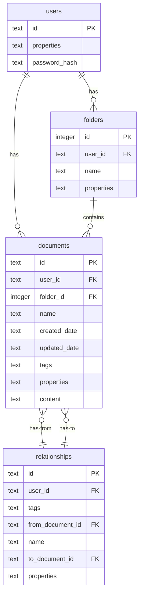

# Entity Relationship Diagram   

```mermaid
erDiagram
    users ||--o{ folders : has
    users ||--o{ documents : has
    folders ||--o{ documents : contains
    documents }o--|| relationships : has-from
    documents }o--|| relationships : has-to
    users {
        text id PK
        text properties
        text password_hash
    }
    folders {
        integer id PK
        text user_id FK
        text name
        text properties
    }
    documents {
        text id PK
        text user_id FK
        integer folder_id FK
        text name
        text created_date
        text updated_date
        text tags
        text properties
        text content
    }
    relationships {
        text id PK
        text user_id FK
        text tags
        text from_document_id FK
        text name
        text to_document_id FK
        text properties
    }
```
