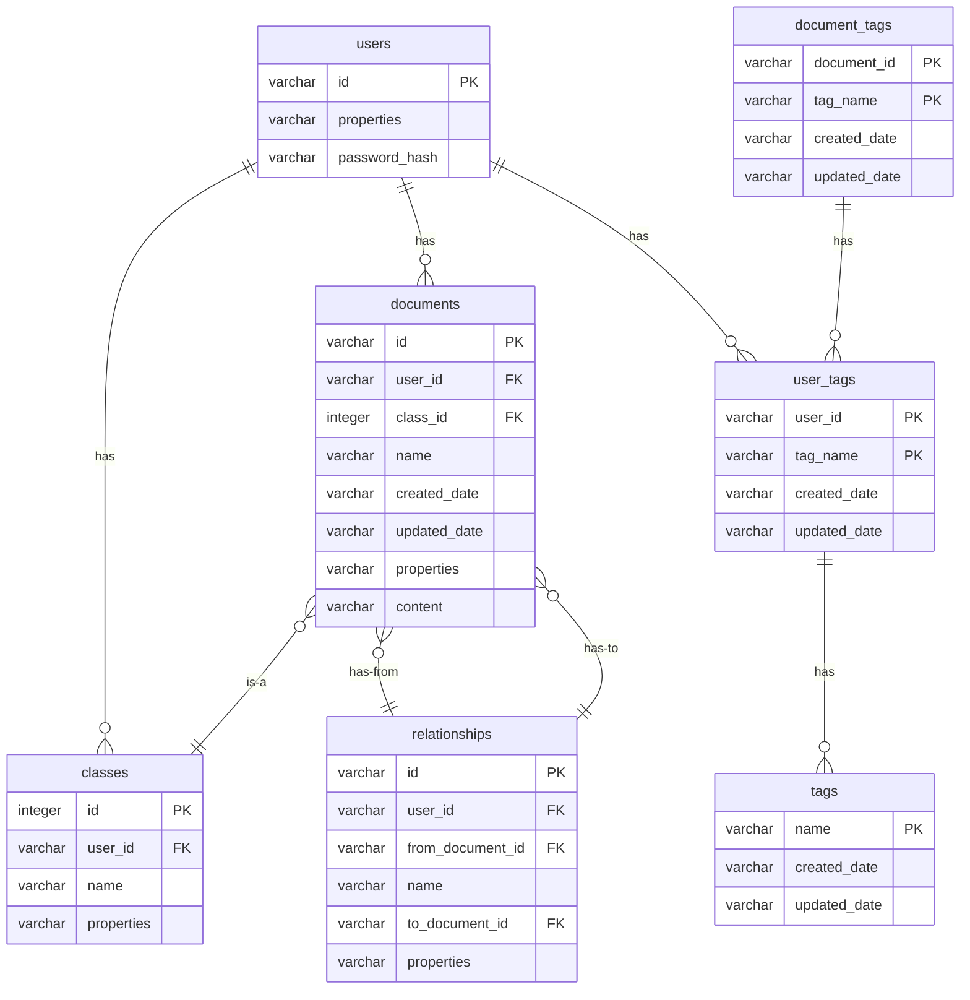

# Entity Relationship Diagram   

```mermaid
erDiagram
    users ||--o{ classes : has
    users ||--o{ documents : has
    users ||--o{ user_tags : has
    documents }o--|| classes : is-a
    documents }o--|| relationships : has-from
    documents }o--|| relationships : has-to
    user_tags ||--o{ tags : has
    document_tags ||--o{ user_tags : has
    users {
        varchar id PK
        varchar properties
        varchar password_hash
    }
    classes {
        integer id PK
        varchar user_id FK
        varchar name
        varchar properties
    }
    documents {
        varchar id PK
        varchar user_id FK
        integer class_id FK
        varchar name
        varchar created_date
        varchar updated_date
        varchar properties
        varchar content
    }
    relationships {
        varchar id PK
        varchar user_id FK
        varchar from_document_id FK
        varchar name
        varchar to_document_id FK
        varchar properties
    }
    tags {
        varchar name PK
        varchar created_date
        varchar updated_date
    }
    user_tags {
        varchar user_id PK
        varchar tag_name PK
        varchar created_date
        varchar updated_date
    }
    document_tags {
        varchar document_id PK
        varchar tag_name PK
        varchar created_date
        varchar updated_date
    }
```
